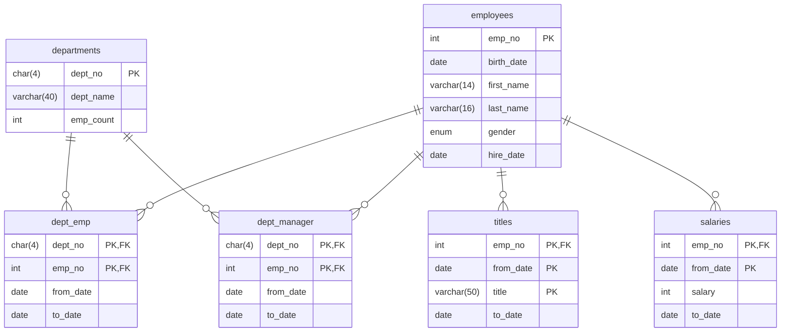

# Real MySQL 8.0 실습

 

## 실습 결과

11. 쿼리 작성 및 최적화
    - [WHERE 절과 ORDER BY 절의 인덱스 이용](https://github.com/kimdev0206/realmysql80/wiki/WHERE-%EC%A0%88%EA%B3%BC-ORDER-BY-%EC%A0%88%EC%9D%98-%EC%9D%B8%EB%8D%B1%EC%8A%A4-%EC%9D%B4%EC%9A%A9)
    - [인덱스 여부에 따른 조인 순서](https://github.com/kimdev0206/realmysql80/wiki/%EC%9D%B8%EB%8D%B1%EC%8A%A4-%EC%97%AC%EB%B6%80%EC%97%90-%EB%94%B0%EB%A5%B8-%EC%A1%B0%EC%9D%B8-%EC%88%9C%EC%84%9C)

## ERD

